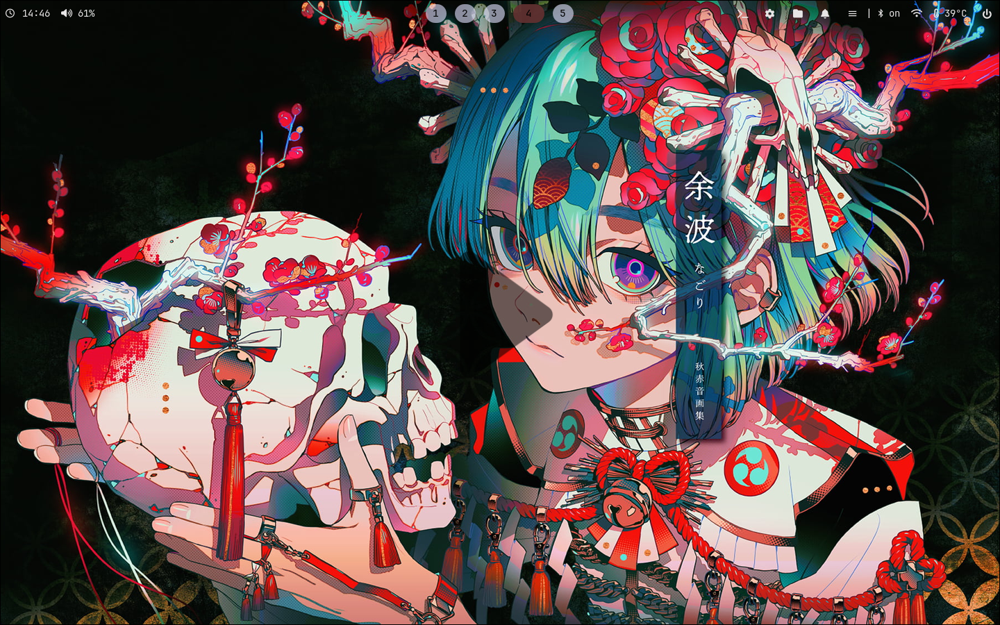
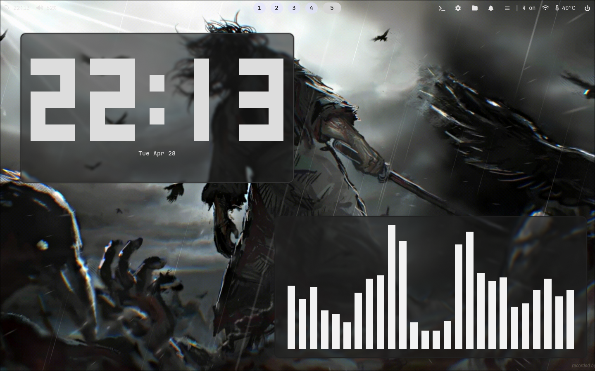
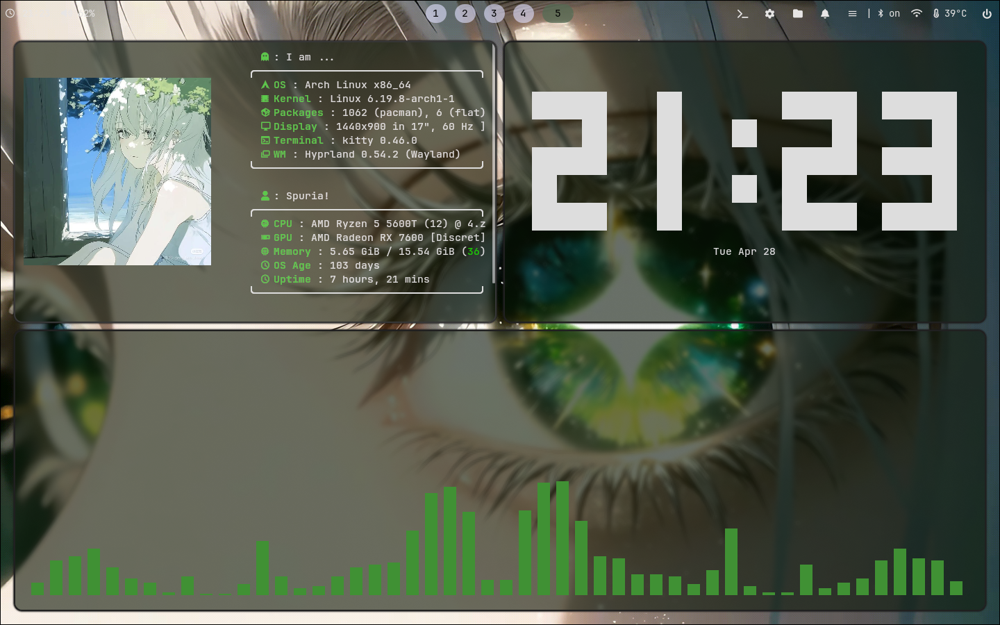
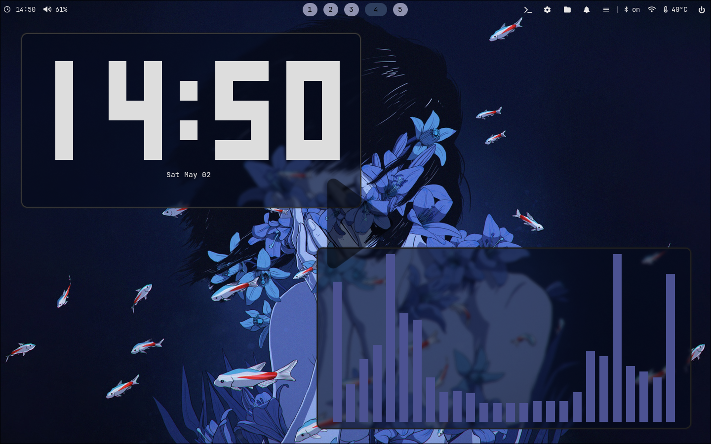

# 💠 Arch Linux Hyprland | My Arch Rice and Setup

Este repositório contém o rice completo do meu Arch Linux e configurações de automação, como a inicialização de aplicativos junto do sistema.

## Visual do sistema:

Abaixo, uma demonstração de como o sistema se parece (vídeo):

[](https://youtu.be/r53hSeIIl2s)





## Troca de temas

O sistema também tem um menu de trocas de temas que, ao selecionar um tema (atualmente 10), ele muda o background atual, a cor do tema do sistema (waybar, notificações dunst, atalho de lançador de aplicativos, etc), background do Vesktop (extensão para Discord) e futuramente pretendo fazer com que mude mais coisas, como o tema do Spicetify (também uma extensão) e Dolphin

[](https://youtu.be/njTyNb3eNFI)

## Automações

Além da automação fácil troca de tema, também há outras automações, atualmente 2 (duas), sendo elas:

- **Inicialização do PC**: Ao inicializar o sistema os aplicativos Discord, Chromium (com 3 páginas abertas: Roblox, Tiktok, Youtube), Spotify e liga sua VPN com Cloudflare WARP. Você pode desativar qualquer coisa dessa automação ou alterar. Por exemplo, caso  o seu navegador seja o Brave, apenas abra o arquivo em ```.config/automate``` e modifique o que quiser (navegador, páginas automáticamente abertas, desativar VPN automática ou até adicionar mais aplicativos de inicialização).

- **Conjunto de aplicativos de terminal**: Se você abrir o terminal (SUPER + Q) e digitar "Mypc" ele abrirá 3 janelas no terminal com programas automaticamente: fastfetch, cava e peaclock. Ao alterar o tema, as janelas não mudam seu tema (como cor da borda e dos aplicativos), mas basta fechar as janelas e rodar o comando novamente. Aliais, a cada troca de tema há uma nova imagem no fastfetch.

# Como usar 📦

**Aqui vai um rápido tutorial de como se usar o sistema:**

- Terminal: SUPER + Q ou waybar  
- Fechar uma janela: SUPER + C  
- Liberar uma janela: SUPER + F  
- Diminuir/aumentar uma janela: Com a janela livre, SUPER + Segundo botão do mouse (segurando)  
- Trocar o wallpaper: Alt + Shift + Enter  
- Dolphin: SUPER + E ou waybar  
- Notificações: Ative e/ou desative na waybar (ícone de sino)  
- Menu de temas: Alt + Shift + F4  
- Cliphist: SUPER + V  
- Apps do sistema: SUPER + ESPAÇO  
- Menu de emojis: SUPER + .  
- Power menu: Ultimo ícone da direita da waybar (de poder)  
- Trocar de workspaces: Alt + Shift + Número do workspace (1 para workspace 1, 2 para workspace 2...)  
- Mover uma janela para outro workspace:  SUPER + Shift + Número do workspace  
- Selecionar uma área da janela para printar: SUPER + Shift + S  
- Sair da sessão: SUPER + M  
- Idle mode (hyprlock): SUPER + J  
- Sound manager: Clique no ícone de volume na waybar  

# Instalação 💻

**Como instalar do zero**

Caso você não saiba como instalar Arch Linux ou esteja tentando Linux pela primeira vez (inclusive, Arch como primeira distro? Você é louco?), eu vou estar deixando um tutorial dentro do arquivo ```howinstall.md.```, que estará em ```repoignore/tutorials``` neste repositório. Você verá como preparar o pendrive, a iso, como instalar o Arch e quais pacotes instalar.

**Pós instalação**

Depois de instalar o Arch Linux do zero, você deve organizar o sistema, colocando cada coisa em seu lugar. No arquivo ```preparing_os.md```, também em ```repoignore/tutorials``` vai haver uma explicação de onde colocar cada pasta, como arrumar o layout do seu teclado caso você não use um teclado ABNT 2 (layout brasileiro) e lidar com possíveis bugs.