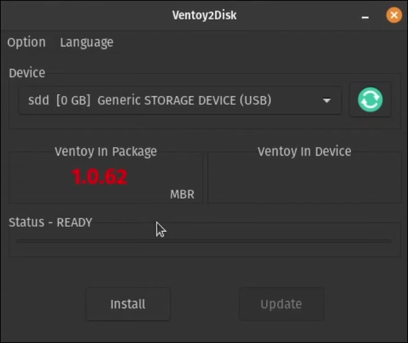
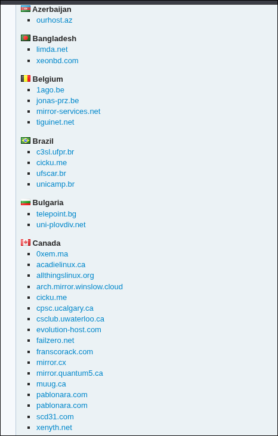
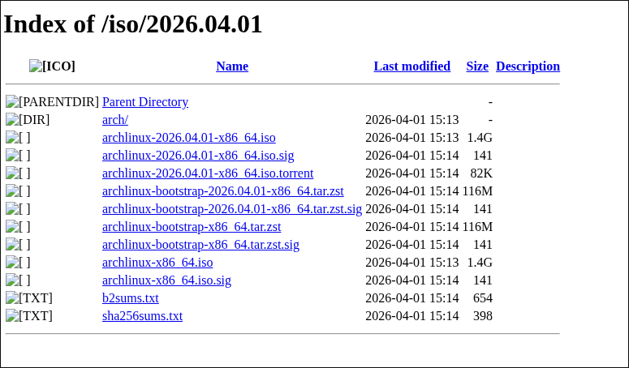
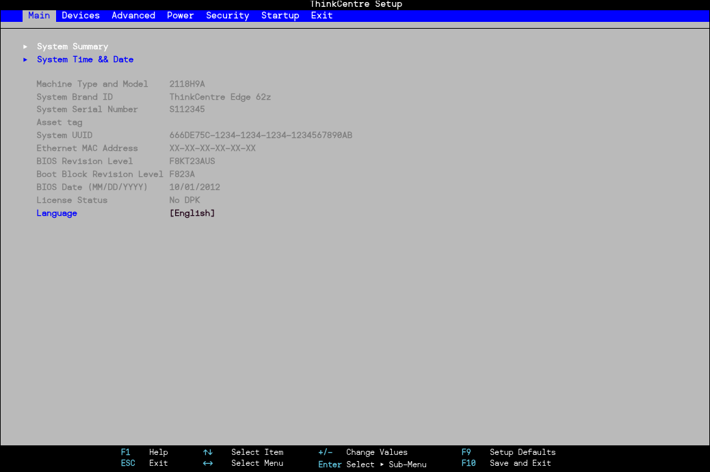
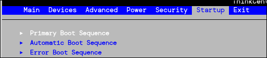
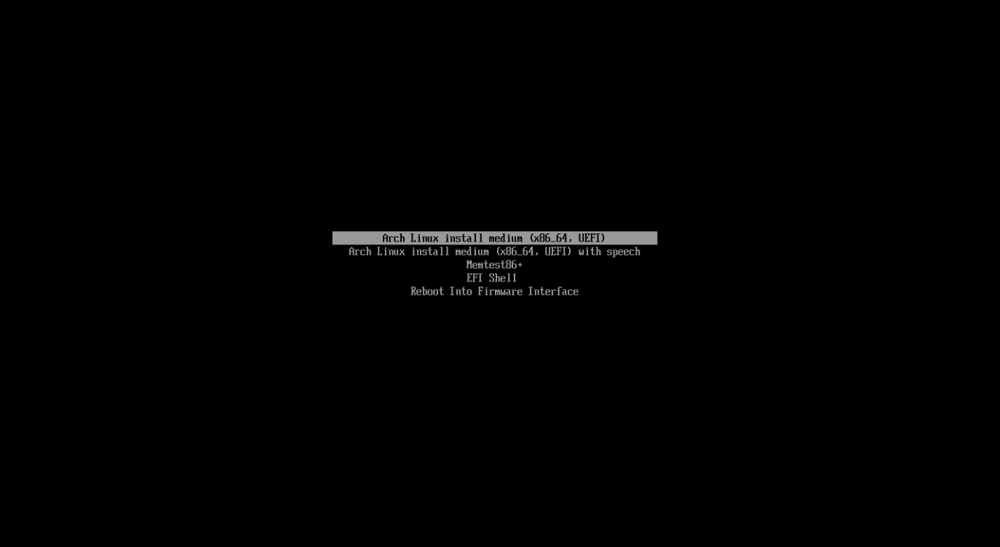
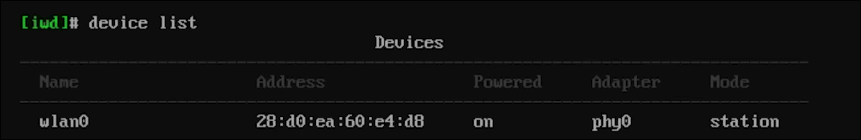
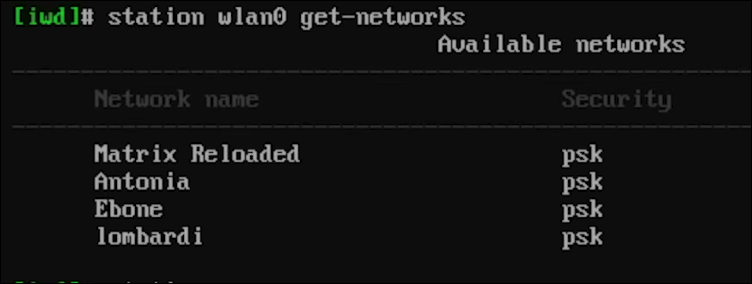
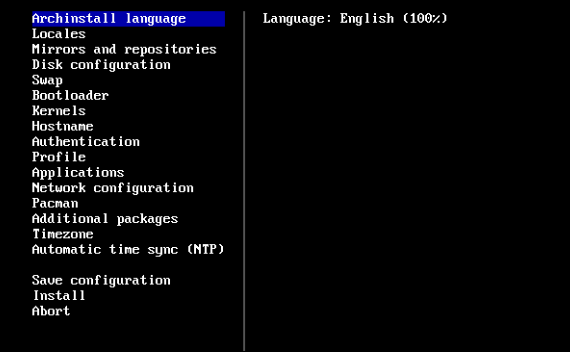

# Como começar?

Se você não sabe como fazer NADA (sua primeira vez fazendo algo parecido), eu vou te dar uma explicação. Primeiro, você vai precisar de um **pendrive**. Nós vamos transformar esse pendrive em um **pendrive bootavel**, o que significa que vamos configura-lo para que ele possa ser "bootavel" na BIOS/UEFI. Primeiro, vá até o [site do ventoy](https://www.ventoy.net/en/index.html)  e instale o programa com a versão do sistema que você estiver utilizando. Ele funciona tanto para Windows quanto para distros Linux, basta pesquisar como instalar para a sua distro (por exemplo yay -S ventoy para arch). Após isso, conecte o seu pendrive numa entrada do dispositivo (recomendo que o pendrive tenha 16 gigabytes ou mais) e abra o software do Ventoy (você precisa extrair a pasta que instalou do Ventoy e procurar o arquivo de inicialização).

Após abrir o Ventoy, você verá uma tela parecida com essa:



Essa é a tela que você verá (ou algo próximo disso). O importante é você selecionar em "Device" o nome do seu pendrive (lembre-se que ele deve estar conectado numa porta usb) e após isso aperte em "install". Se seu computador não for antigo, lembre-se de mudar para GPT em configurações/options o pendrive.

Após fazer isso seu pendrive será transformado em um pendrive bootável. Isso significa que o nome dele será alterado para algo como "Ventoy" e será FORMATADO. Tudo que estava dentro do pendrive será perdido, pois agora ele é um "novo pendrive" que você pode guardar ISOS (falarei disso mais abaixo) e arquivos.

**Instalando a ISO e entrando na BIOS**

Agora que seu pendrive se tornou um pendrive bootavel (podendo ser reconhecido pela BIOS), você vai entrar no seu navegador e pesquisar "Arch Linux ISO". Uma ISO é basicamente uma "imagem/filmagem" de um disco físico, com todo o sistema operacional. De forma fácil, imagine que é um CD/DISCO que tem a mesma música copiada do disco original. É isso. A ISO guarda o "sistema/boot" para você instalar ele. Voltando ao assunto, agora no site do Arch Linux, você deve descer a página e encontra-rá uma lista de países com vários nomes estranhos. Esses nomes são **servidores de download da ISO**. Apenas escolha um servidor aleatório do seu país ou do país mais próximo que o seu. Se você não entendeu direito, relaxe, não é algo essencial de se entender, apenas pegue a região/país mais próximo de você.



Entrando em um desses servidores você verá vários arquivos, alguns que não terminam com nada, alguns que terminam com .iso, etc. Você deve pegar a ISO que tiver a data mais recente (porque é a iso mais atualizada). Nessa imagem, por exemplo, eu recomendaria pegar a iso ```archlinux-2026.04.01-x86_64.iso``` que tem 1.4G de tamanho. Instale a ISO escolhida **DENTRO DO SEU PENDRIVE** (caso tenha instalado em alguma pasta como Downloads passe o arquivo para o pendrive).



**BIOS**

Após ter feito o Download da iso e ter deixado o pendrive bootavel, você está pronto para ir para a BIOS. Antes, certifique-se de que subiu tudo que é importante no seu computador para a núvem. Enfim, desligue o seu computador e enquanto ele liga (desde o momento que você apertar o botão de ligar o computador) **aperte a tecla que sua placa mãe usa para entrar na BIOS**. Se você não sabe qual tecla  você deve apertar pesquise no Google a tecla da sua placa mãe. Por exemplo, a minha placa mãe é uma B550M PRO da Vdh. Quando eu pesquiso a tecla no Google eu descubro que devo apertar a tecla delete (ou seja, na hora que eu ligar o computador apertando o botão de ligar, antes mesmo de dar imagem/tela eu preciso começar a apertar a tecla delete). Fazendo isso você vai entrar na BIOS do seu sistema. Como eu não consigo abrir a minha BIOS e tirar uma print eu vou mostrar uma imagem (abaixo) de como é uma BIOS. Sua bios pode ser mais bonita ou feia que essa, depende de qual é sua placa mãe.



Independente de como for sua BIOS, deve haver uma aba onde você pode mexer em "inicialização". Essa inicialização pode ser chamada de "Primary boot sequence", etc, mas você deve achar algo parecido.



Ao selecionar essa opção você verá vários nomes, pode aparecer algo como "windows", "linux", "ubuntu", etc... tente descobrir qual é o nome do seu pendrive (lembre-se de deixar o pendrive conectado!) e selecione ele. Ao fazer isso você estará avisando para o computador em qual "sistema/armazenamento" ele deve iniciar, ou seja, ele vai iniciar no seu pendrive, e não no seu windows/linux. Depois disso volte para a BIOS (sem desligar o computador, apenas aperte esc para voltar) e vá até alguma aba de exit ou algo parecido, **salve as alterações e inicie o sistema** (Save changes and exit).

Apartir daqui eu não vou conseguir explicar de forma visual (pelo menos na parte da bios), mas é fácil, até um bebê conseguiria. Quando o computador ligar você verá uma tela de escolhas que você pode mexer com as setinhas do teclado ou provavelmente ASDW, algo assim. Talvez tenham várias opções ou apenas uma, mas tente procurar e selecionar a opção que diz "arch_linux.iso" ou algo parecido. É a ISO que instalamos anteriormente DENTRO do seu pendrive. Quando você selecionar ela talvez apareçam questões como "iniciar arch em tal modo, iniciar arch em tal outro modo", só escolha qualquer um (de preferência o com nome mais amigável, admito que só não explico essa parte porque não me lembro bem).





# Iniciando com Arch Install

Agora você oficialmente está "rodando Arch Linux" na sua máquina (mesmo que ainda não tenha instalado o sistema no seu SSD/HD). Você vai ver apenas uma tela preta/um terminal, não se assuste! Outras distros linux ou até instaladores do windows sempre tem um menuzinho interativo e bonitinho, mas o arch é diferente. Você não fez nada de errado por ter um terminal na tela. ISSO É NORMAL. Agora, a primeira coisa que você precisa saber é como funciona um terminal. Basicamente o terminal serve para executar códigos, programas e instalar pacotes. Mesmo que uma ISO seja um "sistema operacional", ao mesmo tempo ela não é o sistema operacional em si já montado/pronto, e sim um "guia" para o seu pc de "como instalar". Antes de instalarmos qualquer coisa você precisa testar se a sua internet está funcionando, afinal, sem internet como você vai instalar pacotes de servidores do Arch?

Para testar isso você pode rodar no terminal: ```ping google.com```. Esse comando tenta mandar uma "mensagem" para o servidor do google. Se aparecer algo no terminal como: "64 bytes from ... time=13.0 ms" significa que você está com internet. Isso acontece porque você está usando **internet via cabo**. Caso não retorne nada ou retorne algum erro de internet (como "sem internet"), isso significa que você está usando WIFI (que é internet não cabeada). Se esse for o seu caso, eu vou explicar de forma curta e rápida a como conectar na internet:

Digite ```iwctl``` no terminal. Isso fará com que você entre no "iwd" (você verá uma diferença na linha do terminal, onde aparecerá [iwd] antes da linha). Após isso, digite ```device_list```. Isso vai listar suas placas de rede (componente que permite você se conectar com a internet) e retornará algo como "name: wlan0, address: seu ip, powered: on", etc. O importante aqui é o nome: wlan0. Sua placa provavelmente terá um nome diferente, é normal. Apenas lembre-se do nome da placa de rede.



Sabendo o nome da sua placa de rede (ex: wlan0), vamos escanear as redes wifis disponíveis através dessa placa de rede. Vamos fazer isso usando o comando ```station wlan0 scan``` (lembre-se que eu estou usando wlan0 como nome da minha placa de rede, use o nome da sua placa) e em seguida ```station wlan0 get-networks```. Isso vai te mostrar uma lista de redes:



Verifique qual é o nome da sua rede e conecte nela usando o comando ```station sua_placa_de_rede connect nome_da_sua_rede```. Por exemplo, se minha placa de rede se chama wlan0 e minha internet se chama rellseas eu conectaria assim: ```station wlan0 connect rellseas```. Após isso ele vai perguntar a senha da sua internet e você deve colocar corretamente. Agora saia do iwd digitando ```exit``` e teste sua internet novamente com "ping google.com". Se tudo estiver certo, você estará conectado a internet.


# Preparando o Arch Install

Agora que você está no Arch e com internet, vamos para os primeiros passos. Comece digitando "archinstall". Isso fará com que você chame um menu de montagem do Arch. É muito mais prático do que instalar cada coisa manualmente (mas ainda instalaremos coisas manualmente). Você verá algo parecido com a imagem abaixo. Podem haver coisas diferentes, afinal as ISOS vão se atualizando, mas você vai entender no geral e qualquer coisa que não for explicada aqui você pode pesquisar ou até perguntar para alguma IA como o ChatGPT:



Você pode se mover entre as opções apertando as setinhas do teclado. Caso seu teclado não tenha setinhas você pode se mover usando as teclas do teclado (ex: J para baixo, L, K, etc). Quando você estiver sobre uma opção, aperte enter para selecionala. Você verá várias abas e perguntas, mas eu vou resumir o que você deve fazer:

Em **archinstall language** selecione o idioma que você fala ou prefere (ex: português). Para facilitar buscas, você pode usar / (barra) para pesquisar. Após isso volte apertando ESC.

Ao entrar em **localidades** você vai ver várias opções, normalmente layout do teclado, idioma de codificação, codificação de localização etc... o importante aqui é o **layout de teclado**, que é onde selecionamos o nosso formato do teclado (ABNT-2, EN, etc). Selecione apenas sua preferência. As outras formas de codificação você pode ignorar, não são tão importantes. Elas servem para mexer na forma dos seus caracteres, deixe o padrão.

Em **mirrors e repositórios** nós vamos fazer uma das coisas mais importantes: escolher as regiões de download do computador. Elas basicamente te ajudam a instalar coisas de forma mais rápida... Vocẽ verá provavelmente 3 (três) opções lá dentro: selecionar regiões, servidores personalizados, repositórios opcionais e adicionar repositório personalizado. Nós vamos mexer apenas em **selecioanr regiões e repositórios opcionais**. Indo em selecionar região, escolha sua região (ex: Brazil, permitindo que você faça downloads mais próximos do Brasil, o que garante uma maior velocidade em downloads), e em repositórios opcionais nós vamos selecionar multilib. Basicamente multilib é o melhor (do meu ponto de vista) porque ele nos permite instalar tanto pacotes 64 bits quanto 32 bits. O normal hoje em dia são programas terem 64 bits, mas algumas aplicações ainda usam 32 bits. O multilib nos permite utilizar as duas, evitando dores de cabeça.


**PARTICIONAMENTO** é uma das partes mais importantes pois é onde você mexe com discos. É aqui que vamos escolher onde vamos instalar o sistema. Quando você selecionar particionamento ele perguntará se você quer usar um sistema de particionamento inteligente ou manual, escolha particionamento manual. Isso significa que nós mesmos vamos escolher onde instalar. Você verá provavelmente várias opções (ou talvez uma também) de "lugares", essas são as partições existentes. Você deve descobrir o que é aquela partição (você pode descobrir pelo nome, armazenamento e o tipo da partição), por exemplo, se seu windows tinha 200gb de armazenamento e uma partição está marcada com 200gb, claramente é seu windows.


Vamos dar um exemplo. Imagine que você tem um SSD de 500 gigabytes. Se você tem 500 gigabytes de FREE SPACE, você pode instalar o windows (ou também pode já estar instalado) em 200 gigas, e o resto você pode usar para o Linux. Esse resto aparecerá como "FREE SPACE" na maioria das vezes. Por que disso? Por que se eu tenho 500 gigabytes de espaço e o windows só usa 200, teriam 300 gigabytes livres no meu SSD para o Linux. Você provavelmente verá outras partições além das dos sistemas como windows e linux. Você deve ver uma partição EFI e uma partição BOOT (ou pelo menos montada em algo como /boot). Essas partições existem porque o sistema precisa de uma partição para iniciar o sistema, e não apenas a partição do sistema. Primeiro o computador roda a partição EFI, que é onde fica o "bootloader". Lá dentro ele roda o script do  grub, que é o nosso inicializador e o grub te mostra um menu mostrando as opções de sistemas que você pode usar. Já as partições montadas em /boot (ou normalmente só chamadas de boot) são onde tem arquivos de inicialização DO LINUX, como o kernel. O EFI depois de ser usado para selecionar linux, ele chama o boot, roda o kernel que inicia o linux. Evite mexer ou apagar essas partições a menos que saiba o que está fazendo, de preferência mexa apenas em partições que você vai sobrepor ou em free space. Ou seja, tem FREE SPACE: Seleciona free space e instala o linux nele. Não tem FREE SPACE porque você colocou tudo no windows: apaga o windows usando cfdisk (pesquise sobre) e volte aqui, e selecione o free space. **Quando vc selecionar a partição antes de "confirmar" o jeito que a partição está (ou seja primeiro escolha a partição, por exemplo o free space e depois clique na partição, e não no "confirmar e sair direto") você vai ter várias opções, como escolher ponto de montagem (onde ela vai ser criada), deletar partição, etc... se você não tiver nenhuma partição no seu disco você deve criar uma partição EFI de alguns megas (uns 500mb, no maximo 1gb se quiser confiança total, mas 500 já são o suficiente) com tipo FAT32 e ponto de montagem em /boot/efi. Inclusive, eu recomendo utilizar tipo EXP4 para a partição do linux em si. Ele é um tipo ok, dificilmente traz problemas, também não é tão rápido quanto algumas especificas (que tem mais chances de problema) mas trazem menos dores de cabeça.**


Agora indo para o menu de volta, nós vamos para a opção **Swap**. Swap é uma extensão da sua "memória" para o SSD/HD. Imagine que a sua RAM está lotada, você tem 16gb de RAM e ela ficou 100% cheia. O Swap é um pedaço do seu SSD separado (por exemplo 4 gigabytes) que será usado como espaço para a memória. Se você tem RAM suficiente: pode desativar essa opção, não tem tanta importância para você. Agora se você tem pouca RAM, eu recomendaria deixar ativo. Ele não "aumenta a RAM", mas segura dados para quando houver espaço livre na RAM.

Agora em **inicializador** temos umas das coisas mais importantes: o boot. Aqui você verá duas opções: inicializador e imagens de kernel, vamos usar apenas o inicializador. O inicializador é o software/forma que sua bios vai usar para ligar o computador. Se você pretende ter um rice como o meu, com dual boot ou mesmo que sem dual boot, queira ter um boot bonito, eu recomendo escolher grub, pois já tenho até temas para ele. 

Em **kernels** você deve escolher um kernel linux (um núcleo para o sistema). Você pode escolher o kernel que preferir (e inclusive mais de um kernel), mas eu prefiro escolher apenas o kernel normal (apenas "linux").

Agora em **nome do computador (hostname)** não é nada mirabolante, você vai apenas colocar o nome DO SEU COMPUTADOR (e não do seu usuário ainda). Coloque algum nome que você goste, ou pode deixar o padrão do Arch mesmo (archlinux).

Indo para **autentificação** você terá de fazer uma das coisas mais importantes: configurar seu usuário. Você verá 3 opções: senha de root, conta de usuário e configuração de login U2F. Vamos usar apenas as duas primeiras. Em senha de root você pode colocar uma senha para o root (usuário supremo/raiz do sistema). Se você se preocupa com segurança, pode colocar alguma senha. Não haverá problema se não colocar também, só será menos seguro. Agora em conta de usuário você irá criar o seu usuário, a conta que você vai usar todos os dias. Adicione um usuário e de um nome a ele (ex: spuria) e uma senha. Após isso ele perguntará se você quer que esse usuário seja um **usuário sudo**, diga que sim. Isso fará com que ele seja um usuário que pode ter o mesmo nível de permissões que o root (mas usando comandos de permissão, o tal "sudo").

Indo em **perfil** ele perguntará o tipo de perfil, isso significa o "tipo de instalação"... sei que parece confuso, até eu acho um pouco de explicar, mas basicamente ele quer te perguntar se você quer que o computador já "seja montado" (desktop), se ele vai ser um servidor (server), etc.... Você deve selecionar a opção MINIMAL. Isso significa que vamos fazer uma instalação minima. "Por que fazer uma instalação mínima ao invés de uma pronta (desktop)?", Porque uma instalação pronta já vem com pacotes instalados, pacotes que você NÃO pediu. Isso pode deixar o sistema pesado, não dar total liberdade de organização/customização que você deseja e ainda trazer bugs. Vamos fazer uma **instalação MINIMA**.

Indo em **applications** você verá várias opções: bluetooth, audio, firewall, serviço de impressão, additional fonts... wow, tem coisas que nem eu conheço aqui. Coisas novas até pra mim. Mas enfim, depois de pesquisar, eu vou te dizer o que fazer. Em **bluetooth** marque sim (acredito eu que você vá querer bluetooth no seu sistema, certo?), e em **áudio** você vai selecionar o "serviço de audio" que seu sistema vai ter. Imagine que é como escolher quem vai trabalhar/ser eu empregado pra você. O melhor e que eu mais recomendo é pipewire. É o mais moderno e novo hoje em dia. Quanto aos **serviços de impressão** pelo que eu entendi são basicamente... impressoras. Se você não usa uma impressora no computador (creio eu que não, mas nunca sabemos o que acontece na casa do outro) pode deixar desativado. Sobre o **firewall**, se você não sabe firewall é um "filtro" que monitora o tráfego da rede (entrada e saída). Ele protege o computador contra acessos não autorizados e possíveis atividades maliciosas/vírus. É basicamente um antívirus da sua rede. Ele analisa o seu tráfego e permite que ele continue ou impede/derruba que continue. Ele também pode bloquear TUDO que entra no seu computador (se você configurar), impossiblitanto de entrarem no seu computador através da rede. Dentre as duas opções disponíveis eu recomendo você selecionar a **ufw**, que é a mais simples, mas também mais fácil de mexer. Caso você realmente queira uma proteção absurda, pode escolher o firewalld, mas saiba que é mais complexo... Se preferir, pode também não instalar nenhum firewall, mas eu não recomendo pela sua segurança. Agora, as **additional fonts** são fontes adicionais (como o nume sugere). Não precisa instalar nada se não quiser, após a instalação o meu rice já tem um pacotes de fontes se você precisar.

Em **configurações de rede** você vai escolher como vocẽ quer configurar a sua rede. Você dificilmente escolheira manual já que teria que configurar manualmente DNS, IP, etc. São normalmente mais usados em servidores, em desktops são desnecessários. Eu recomendo você escolher a opção **use networkmanager (backend)**. Eu recomendo ela na maioria dos casos e é um padrão hoje em dia. A IWD também é boa, mas pode ser incompativel com algumas coisas. Escolha a que você preferir, mas eu recomendo a networkmanager backend.

Em **pacman**, que também é algo novo para mim, você diz se você quer ou não que as saídas do pacman sejam coloridas... pacman é o instalador do Arch Linux. Isso não faz diferença, mas se você quiser algo colorido, enfim, é do seu gosto/escolha.

Em **pacotes adicionais** nós vamos aproveitar para instalar alguns pacotes antes de instalar os reais do sistema. Use a / (barra) para pesquisar e instale esses pacotes: nano, pacman, chromium (ou firefox, qualquer navegador que você quiser).

Em **fuso-horário** escolha o fuso horário de onde você mora ou preferir (ex: Brazil-East).

**Caso tenha ficado confuso ou queira ver isso de uma forma mais rápida e sem explicações, veja o vídeo abaixo onde eu instalo pelo archinstall:**

[[Themes](../assets/image23.png)](https://youtu.be/zf8ke7ghJvg)


## Por fim, aperte em INSTALAR.

Após instalar reinicie o computador, vá na bios novamente onde selecionamos o nosso pendrive, procure pela nova partição linux e selecione-a. Após isso inicie o computador e você estará no seu archlinux. Diferentemente do que você esperava, você não vai estar em uma tela bonita cheia de temas: você vai estar novamente em um terminal. Isso porque nós não temos uma interface pronta, já que estamos fazendo uma instalação manual. Agora, estamos na reta final, apenas instalar os ultimos pacotes que vão ser realmente usados no sistema. Abaixo, farei uma lista em tópicos de cada tema sobre o que você deve instalar usando o comando ```sudo pacman -S pacotes```:

**Hyprland**

- hyprland, hyprlock, hypridle, hyprshade

**Organização/sistema**

- waybar, kitty, dolphin, dolphin-plugins, kio-admin, ark, rofi-wayland, rofi-emoji, polkit-kde-agent, qt5-wayland, qt6-wayland, xdg-desktop-portal-gtk, xdg-desktop-portal-hyprland, git, keyd, curl, zsh, zsh-completions, flatpak

**Visuais/helpers**

- dunst, cliphist, wl-clipboard, pavucontrol, htop, blueman, awww, grim, slur
```obs: grim e slur são usados para tirar prints do sistema selecionando uma área (slur) e tirando a  print (grim). Se você não quiser tirar prints do sistema, pode ignora-lós.```

**Fontes**

- ttf-font-awesome, ttf-jetbrains-mono-nerd, ttf-opensans noto-fonts, ttf-droid ttf-roboto

Após fazer tudo isso você terá baixado boa parte dos arquivos necessários, mas ainda falta baixar os aplicativos que usamos (como VsCode). Para isso, você deve primeiro instalar o AUR Helper ```yay``` através do github. Rode o comando ```git clone https://aur.archlinux.org/yay.git```, entre na pasta usando ```cd yay``` e em seguida use ```makepkg -si```. Esse comando makepkg basicamente le o PKGBUILD, que é uma "receita" que o makepkg segue para instalar o programa.

Após instalar o aur helper (um "instalador de pacotes oficiais ou que não estão nos repositórios do arch linux", ou seja, repositórios não oficiais) você deve instalar alguns pacotes/aplicativos que também vou listar abaixo, utilizando o comando ```yay -S pacotes```:

- visual-studio-code-bin (vscode)
- ani-cli (free anime, opcional)
- cloudflare-warp-bin (vpn)
- minecraft-launcher (jogos/minecraft)
- peaclock (decoração)
- pipes.sh (decoração)
- soundux (um soundpad para linux)
- spotify (música)
- spicetify (extensão do spotify)
- vesktop (extensão do discord)
- steam (jogos)
- obsidian (anotações, opcional)
- obs-studio (gravações, opcional)

Como dito anteriormente se você teve atenção, o yay é um aur helper, ou seja, ele pode instalar tanto pacotes não oficiais do arch linux quanto pacotes oficiais. Portanto, ao invés de você ir manualmente instalar as coisas primeiro pelo pacman e depois pelo yay, você pode simplesmente instalar tudo de uma vez pelo yay. Abaixo eu vou deixar a lista inteira do que você deve instalar, usando o yay para facilitar:

```yay -S hyprland hyprlock hypridle hyprshade waybar kitty dolphin dolphin-plugins kio-admin ark rofi-wayland rofi-emoji polkit-kde-agent qt5-wayland qt6-wayland xdg-desktop-portal-gtk xdg-desktop-portal-hyprland git keyd curl zsh zsh-completions flatpak dunst cliphist wl-clipboard pavucontrol btop blueman awww grim slurp ttf-font-awesome ttf-jetbrains-mono-nerd ttf-opensans noto-fonts ttf-droid ttf-roboto visual-studio-code-bin ani-cli cloudflare-warp-bin minecraft-launcher steam peaclock pipes.sh soundux spotify spicetify vesktop obsidian obs-studio```

# Ativando o necessário

Por fim, agora apenas ative tudo que for necessário (bluetooth, etc) com o comando abaixo:

```systemctl enable --now NetworkManager, bluetooth, pipewire, seatd```