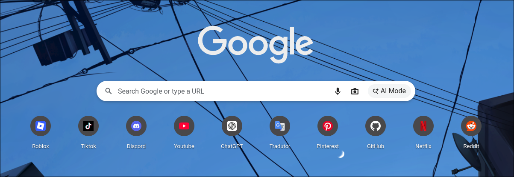
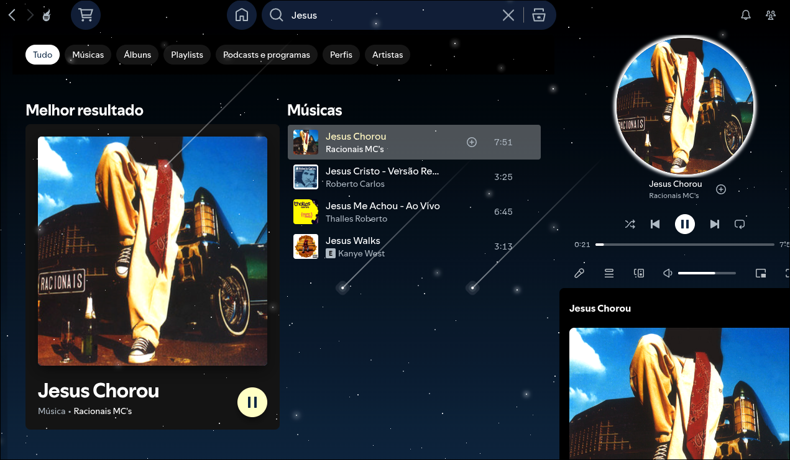
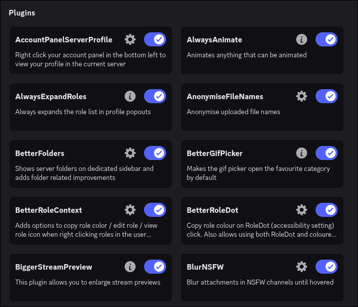
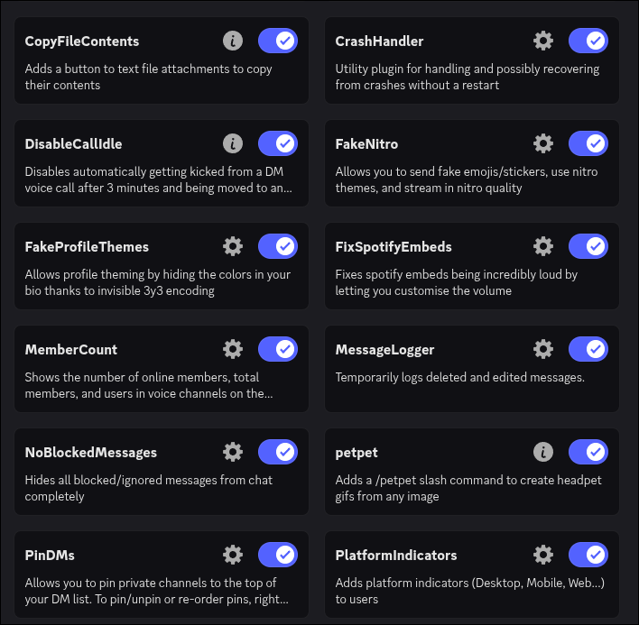
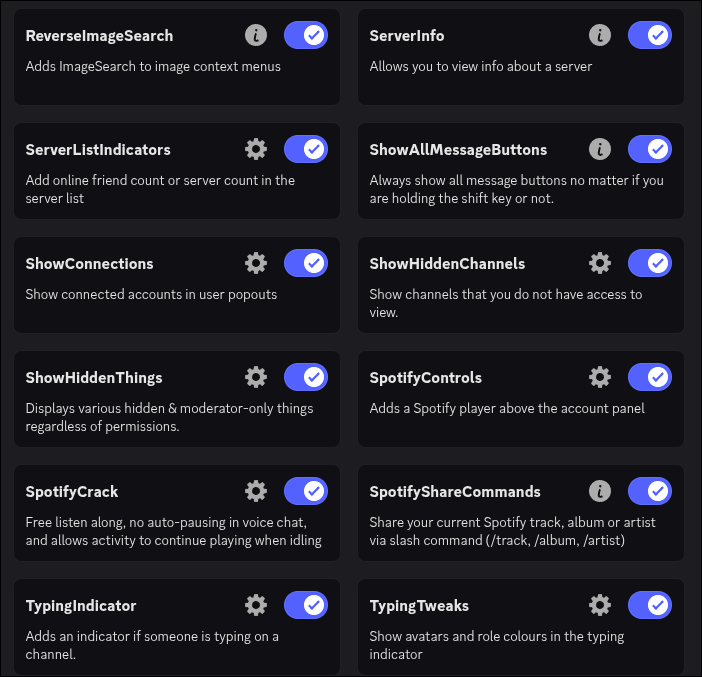
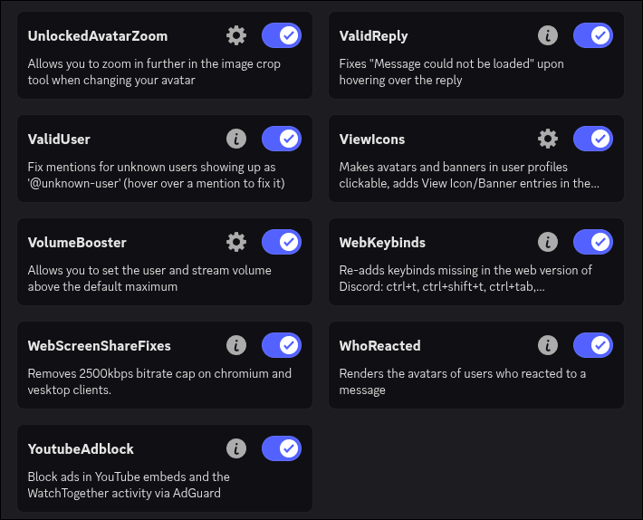
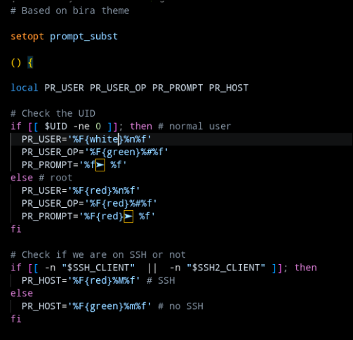
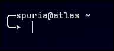

# Pós instalação

Após a instalação do sistema você precisa colocar cada coisa no lugar correto. Como o meu teclado é 75% e em inglês (aula f75) e eu sou brasileiro e já tenho costume a anos de usar layout ABNT-2 (layout brasileiro), eu arrumei as posições das minhas teclas através do **Keyd**. Caso você prefira outro layout, pode deixar ele de lado na organização.

## .Config

Abra seu dolphin apertando SUPER + E (caso não saiba, SUPER é como chamamos a tecla windows no linux) e vá para a home. Em home, aperte Control + H para ver as pastas e arquivos escondidos. Haverá uma pasta chamada ".config", copie tudo que estiver na .config do repositório git e cole dentro dessa pasta ```.config``` da sua home.

## Home

Ainda na pasta home, cole tudo que estiver no diretório home do repositório dentro dela. Ou seja, você deve colocar em /home as pastas: Profile_pictures, Sounds, VsCode, Wallpapers e os arquivos .bashrc, .gitconfig e .zshrc.

## Sddm

O sddm é a tela de login personalizada do PC (que também muda com a troca de temas). Você deve copiar a pasta "themes" e o arquivo "EXPLICACAO.MD" dentro do diretório sddm do repositório git, ir para este local: ```/usr/share/sddm``` e colar eles lá. O arquivo EXPLICACAO.md é uma explicação em português do Brasil sobre como funciona o sddm e como utilizá-lo. Para o SDDM funcionar você precisa ativá-lo (caso já não tenha feito isso seguindo os passos do howinstall.md). Para isso, rode o comando ```sudo systemctl enable --now sddm```. Mesmo com seu SDDM já funcionando, ele não vai estar personalizado. Para deixarmos personalizado, você deve mexer em um **arquivo de configuração do SDDM** onde você pode indicar o tema desejado, etc. Esse arquivo fica em ```/etc/sddm.conf```. Eu também já vou deixar a minha configuração (já personalizada e que troca com o tema) dentro de ```archlinux/sddm/put_on_etc/sddm.conf```.

## Grub (ao ligar o PC)

Grub é um bootloader, ou seja, um inicializador. Após ligar o PC ele é o primeiro software a ser executado (depois da BIOS/UEFI), e se você tiver mais de um sistema instalado (dual boot) ele mostra um menu de escolha de sistema. Ao ligar o PC normalmente você veria uma tela preta e sem graça pedindo para você escolher o sistema que quer usar (caso você tenha selecionado GRUB na instalação do Arch), mas podemos colocar temas no grub, como tema de Minecraft.

Abra o diretório "grub" no repositório. Lá haverá uma pasta chamada "themes", que é onde guardamos os temas e um arquivo README.md onde eu explico como usar. Copie essa pasta e o arquivo e vá até ```/boot/grub/``` no sistema e cole-os lá dentro. Mesmo você já tendo uma pasta de temas, você ainda precisa dizer para o grub qual tema usar. Dentro do arquivo README.md eu explico isso no tópico "COMO INSTALAR OU TROCAR UM TEMA", mas aqui vai uma explicação rápida:

Vá até ```/etc/default``` e edite o arquivo "grub" (ou seja /etc/default/grub) utilizando ```sudo nano```.
Procure pela linha ""GRUB_THEME="/boot/grub/themes/nome-do-tema/theme.txt" e coloque o nome do tema (caminho até o arquivo theme.txt).

E por fim atualize o grub, alterando de forma definitiva o tema (sem esse comando o grub não entende que deve "atualizar" seu arquivo de configuração): ```sudo grub-mkconfig -o /boot/grub/grub.cfg```.

## Keyd

Keyd é um manipulador de teclas (keys) do teclado. Como eu uso um teclado 75% em inglês mas tenho costume com layout ABNT-2 (brasileiro), eu uso o Keyd para mudar as teclas e deixar de forma que eu tenho costume. Se você não preferir esse formato, pode apenas ignorar ou até mudar para um formato que você prefira.

Primeiro vá até o diretório "keyd" do repositório git e copie o arquivo default.conf dentro dele. Após isso, vá até "/etc/keyd" (caso você AINDA não tenha o keyd instalado essa pasta "keyd" dentro de etc não vai existir, então a crie usando "mkdir keyd") e cole o arquivo lá dentro.

## Fontes

As fontes do sistema já podem estar lá, mas é importante garantir para que não haja erros no seu sistema. Vá até o diretório fonts do repositório git e copie tudo lá dentro. Depois vá até ```~/.local/share/fonts``` e cole tudo lá. Caso ele diga que algum arquivo já exista, melhor ainda, pois ele já estaria lá.

## VsCode (code)

Se você quiser usar as mesmas extensões e configurações que eu tenho no VsCode, aqui vão elas:

**Configurações**

Editor: Word Wrap: ON

**Extensões**

Python Environments
Ballerini Theme
Dracula Theme
Live Server
Material Icon Theme
Pylance
Python
Python Debugger
Tokyo Night (theme)

## Navegador

Se você quiser usar as mesmas extensões e souber a mesma decoração/organização que eu uso no meu navegador (no momento que estou escrevendo isso 28/04/2026, Chromium), aqui vão elas:

**Extensões**

AdBlock
BloxFinder
RoGold Ultimate
RoPro
RoSeal
RoValra
SearchBlox
Shazam

**Organização**



**Sites favoritados**

https://pixelartvillage.com/

https://recursivearts.com/virtual-piano/

https://www.google.com/?olud


## Spicetify

Após instalar o spotify e o spicetify rodando ```yay -S spicetify``` (e já tendo o spotify instalado), rode os seguintes comandos:

- ```sudo chmod a+wr /opt/spotify```  
- ```sudo chmod a+wr /opt/spotify/Apps -R```  

Isso faz com que o spicetify tenha permissão para acessar as pastas protegidas/privadas do Spotify para injetar seu código. Por fim, rode o comando ```spicetify backup apply```.  Depois disso basta você reabrir o Spotify e você verá no topo esquerdo um simbolo novo de mercado.


Lá você pode instalar temas e extensões, como adblocks. Eu recomendo usar as extensões adblockify e auto skip vídeos. De temas eu recomendo o "Starry night brandon chen, julissa laignelet". Abaixo uma demonstração:




## Vesktop (Discord)

Como você já tem o vesktop instalado (caso não tenha, instale usando ```yay -S vesktop```), você já tem um tema pronto que altera o background conforme o tema atual do sistema que eu deixei pronto para vocẽ. Para isso, copie a pasta vesktop dentro de .config do repositório git e procure por ela na .config do seu pc e cole a pasta de temas lá dentro. Assim você já terá um tema configurado. Quando você abrir o vesktop você pode ativar várias opções chamadas de plugins. São práticamente "extensões". Abaixo vou deixar uma lista com o nome de todos os plugins que eu utilizo:










## Zsh Shell

Resumidamente shell é o seu "terminal puro". A interface do terminal que você ver ao abrir é o Kitty, mas o seu SHELL, que é o programa que INTERPRETA OS COMANDOS E FORNECE INTERFACE DE TEXTO é o shell. O shell padrão do arch é o bash, porém como queremos uma estilização bonita nós utilizamos o shell zsh, que é um shell mais personalizavel. Caso você não tenha instalado ele, instale rodando o comando ```sudo pacman -S zsh```. Depois disso você pode verificar se realmente instalou rodando o comando "zsh --version". Em seguida, para definir o Zsh como o seu shell padrão você deve rodar o comando ```chsh -s /bin/zsh``` (chsh significa change shell), e, em seguida reinicie o computador ou a sessão.

Só de fazer isso seu terminal não ficará automaticamente bonito, mas sim só mudará o shell. Para deixar do jeito que o meu terminal é (ilustração abaixo), nós precisamos instalar outro pacote, o tal do **Oh My Zsh**. Para isso, você precisa ter o curl instalado para instalar o oh-my-zsh. Em seguida instale o oh-my-zsh através do curl:

```sh -c "$(curl -fsSL https://raw.githubusercontent.com/ohmyzsh/ohmyzsh/master/tools/install.sh)"``` (se após isso for perguntado se você quer sobrevescrever com o OH MY ZSH, diga que sim)

Após isso você precisa ir no arquivo **.zshrc** que está escondido na /home. Ele é o arquivo de configuração do zsh, que, por sinal eu já deixei configurado para você. Lá você pode trocar os temas na linha **ZSH_THEME="nome_do_tema"**.

Você também deve adicionar os pluggins que eu uso para que funcione. Relaxe, é fácil e não são pluggins ruins, na real eles ajudam no dia a dia: você digita algo errado e o zsh sugere algo que você pode ter tentado escrever, mostra se o comando está certo ou errado com cores verdes e vermelhas, etc. Para instalar o pluggin use o comando:

 ```git clone https://github.com/zsh-users/zsh-autosuggestions ~/.oh-my-zsh/custom/plugins/zsh-autosuggestions```

Sobre a COR do nome de usuário, o @ e o nome do pc, você pode alterar elas indo no arquivo ```~/.oh-my-zsh/themes/gnzh.zsh-theme```. Esse é o tema que estamos utilizando no zsh. Lá você verá algo  mais ou menos assim:



Você pode alterar as linhas que contem uma cor dentro de chaves, como a ```PR_USER='$F{white5}%n%f'```. Você pode botar o nome  da cor que quiser. Não só cores mas também pode customizar por exemplo o icone de local host, etc. Caso você queira ficar com a configuração igual a minha e esteja com preguiça de trocar as cores manualmente, você pode copiar o que está dentro do arquivo e colar no tema do zsh. O arquivo estará em ```archlinux/home/oh-my-zsh/gnzh.zsh-theme``` no repositório/pasta e você deve colocá-lo dentro de ```~/.oh-my-zsh/themes/gnzh.zsh-theme```.  

 Após fazer a alteração do tema e instalar os pluggins, basta você "atualizar" o zsh utilizando o comando ```source ~/.zshrc```.

Caso você não perceba diferença no shell, as vezes depois de alterar o terminal para zsh e oh-my-zsh ele tenha reescrito o arquivo .zshrc que eu fiz. Basta você ir novamente no github, copiar o código do arquivo ~/.zshrc e colar dentro do arquivo no seu pc. Por fim, seu terminal deve estár com essa aparência:

